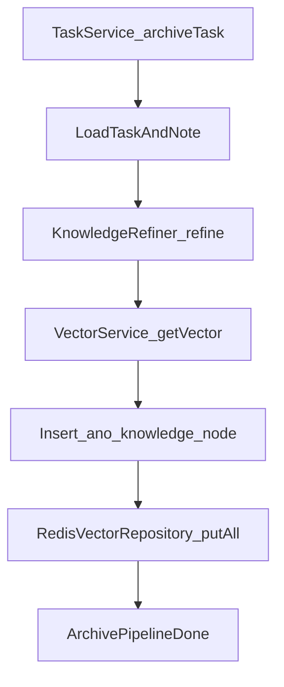

# ANO 知识原子化流水线 MVP 实施规划

## 结论

- 以当前仓库为准（规则优先）：先实现 **同步 MVP**，不扩展“归档失败补偿机制”。
- 技术路径：`TaskServiceImpl.archiveTask()` 归档成功后触发知识提炼，完成 `MySQL(ano_knowledge_node) + RedisHash(node:{id})` 双写。
- 供应商按你确认：Spring AI 接阿里云百炼兼容层（Chat + Embedding）。

## 与现项目对齐点

- 现有可复用：
  - 知识索引基础：`[C:/Users/Administrator/Desktop/ANO-back/src/main/java/com/tdotd/ano/service/KnowledgeIndexBootstrapService.java](C:/Users/Administrator/Desktop/ANO-back/src/main/java/com/tdotd/ano/service/KnowledgeIndexBootstrapService.java)`
  - 知识实体与 mapper：`[C:/Users/Administrator/Desktop/ANO-back/src/main/java/com/tdotd/ano/domain/entity/KnowledgeNode.java](C:/Users/Administrator/Desktop/ANO-back/src/main/java/com/tdotd/ano/domain/entity/KnowledgeNode.java)`、`[C:/Users/Administrator/Desktop/ANO-back/src/main/java/com/tdotd/ano/mapper/KnowledgeNodeMapper.java](C:/Users/Administrator/Desktop/ANO-back/src/main/java/com/tdotd/ano/mapper/KnowledgeNodeMapper.java)`
  - 归档入口：`[C:/Users/Administrator/Desktop/ANO-back/src/main/java/com/tdotd/ano/service/impl/TaskServiceImpl.java](C:/Users/Administrator/Desktop/ANO-back/src/main/java/com/tdotd/ano/service/impl/TaskServiceImpl.java)`
- 规则约束落实：构造器注入、`BusinessException`、常量下沉 `common.constant`、Service 事务边界。

## 分步实施（按你要求先做基础设施）

### 阶段 A：基础设施（先实现）

1. 新增向量工具类
  - 文件：`[C:/Users/Administrator/Desktop/ANO-back/src/main/java/com/tdotd/ano/common/utils/VectorUtils.java](C:/Users/Administrator/Desktop/ANO-back/src/main/java/com/tdotd/ano/common/utils/VectorUtils.java)`
  - 能力：`toBuffer(float[] vector)`，按 **Little-Endian** 输出 `byte[]`。
2. 新增 AI 提炼组件
  - 文件：`[C:/Users/Administrator/Desktop/ANO-back/src/main/java/com/tdotd/ano/infrastructure/ai/KnowledgeRefiner.java](C:/Users/Administrator/Desktop/ANO-back/src/main/java/com/tdotd/ano/infrastructure/ai/KnowledgeRefiner.java)`
  - 依赖：`ChatClient`
  - 方法：`refine(String title, String description, String noteContent)`
  - 输出：Markdown 结构（核心原理 / 执行经验 / 避坑指南）
  - 日志：记录提炼耗时与 taskId（不打 note 原文）
3. 新增向量服务
  - 文件：`[C:/Users/Administrator/Desktop/ANO-back/src/main/java/com/tdotd/ano/infrastructure/ai/VectorService.java](C:/Users/Administrator/Desktop/ANO-back/src/main/java/com/tdotd/ano/infrastructure/ai/VectorService.java)`
  - 依赖：`EmbeddingModel`
  - 方法：`getVector(String content)` 返回 `float[]`
  - 校验：维度必须 1536，不符抛 `BusinessException` , 可以通过constants包中的已经定义的常量获取
4. 新增 Spring AI 配置与常量
  - 更新：`[C:/Users/Administrator/Desktop/ANO-back/pom.xml](C:/Users/Administrator/Desktop/ANO-back/pom.xml)`（新增 Spring AI + 供应商 starter）(每一个依赖是做什么的, 做好注释)
  - 更新：`[C:/Users/Administrator/Desktop/ANO-back/src/main/resources/application.yml](C:/Users/Administrator/Desktop/ANO-back/src/main/resources/application.yml)`（`spring.ai.`* for DashScope）
  - 新增：`[C:/Users/Administrator/Desktop/ANO-back/src/main/java/com/tdotd/ano/common/constant/KnowledgeArchiveConstants.java](C:/Users/Administrator/Desktop/ANO-back/src/main/java/com/tdotd/ano/common/constant/KnowledgeArchiveConstants.java)`（提示词模板片段、维度、Redis 字段名）

### 阶段 B：领域与持久化补齐

1. 新增归档请求 DTO（record）
  - 文件：`[C:/Users/Administrator/Desktop/ANO-back/src/main/java/com/tdotd/ano/domain/dto/KnowledgeArchiveRequest.java](C:/Users/Administrator/Desktop/ANO-back/src/main/java/com/tdotd/ano/domain/dto/KnowledgeArchiveRequest.java)`
  - 字段：`taskId`
2. 新增 Redis 写入仓储
  - 文件：`[C:/Users/Administrator/Desktop/ANO-back/src/main/java/com/tdotd/ano/infrastructure/persistence/RedisVectorRepository.java](C:/Users/Administrator/Desktop/ANO-back/src/main/java/com/tdotd/ano/infrastructure/persistence/RedisVectorRepository.java)`
  - 使用：`redisTemplate.opsForHash().putAll(...)`
  - key 规则：`node:{id}`
  - `vector` 字段统一经 `VectorUtils.toBuffer()`

### 阶段 C：业务编排与触发

1. 新增知识归档服务实现
  - 文件：`[C:/Users/Administrator/Desktop/ANO-back/src/main/java/com/tdotd/ano/service/impl/KnowledgeServiceImpl.java](C:/Users/Administrator/Desktop/ANO-back/src/main/java/com/tdotd/ano/service/impl/KnowledgeServiceImpl.java)`
  - 编排：
    - 查 Task + Note（按 taskId）
    - `KnowledgeRefiner.refine(...)`
    - `VectorService.getVector(...)`
    - 组装 `KnowledgeNode` 并 `knowledgeNodeMapper.insert(...)`
    - `RedisVectorRepository.save(...)` 双写到 Redis
  - 事务：MySQL 写入受 `@Transactional` 保护（MVP 下 Redis 失败先抛业务异常，让调用方感知）
2. 将触发挂到任务归档
  - 更新：`[C:/Users/Administrator/Desktop/ANO-back/src/main/java/com/tdotd/ano/service/impl/TaskServiceImpl.java](C:/Users/Administrator/Desktop/ANO-back/src/main/java/com/tdotd/ano/service/impl/TaskServiceImpl.java)`
  - 在 `archiveTask(...)` 成功归档后调用知识归档服务（无新增 controller）

## 关键数据流（MVP）

## 验收与验证

- 单次归档后：
  - `ano_knowledge_node` 新增 1 条（`id/source_task_id/title/content/vector`）
  - Redis 存在 `node:{id}`，含 `id/title/content/vector`
- 启动后索引检查：`idx:knowledge` 可继续复用现有初始化逻辑
- 编译与质量：`mvn -DskipTests compile` 通过，新增/改动文件无 lints

## MVP 后续（不在本次范围）

- 归档后异步化与重试队列（避免 AI 延迟阻塞）
- 幂等去重（同 task 重复归档时版本策略）
- 失败补偿状态机（knowledge_generation_failed）

